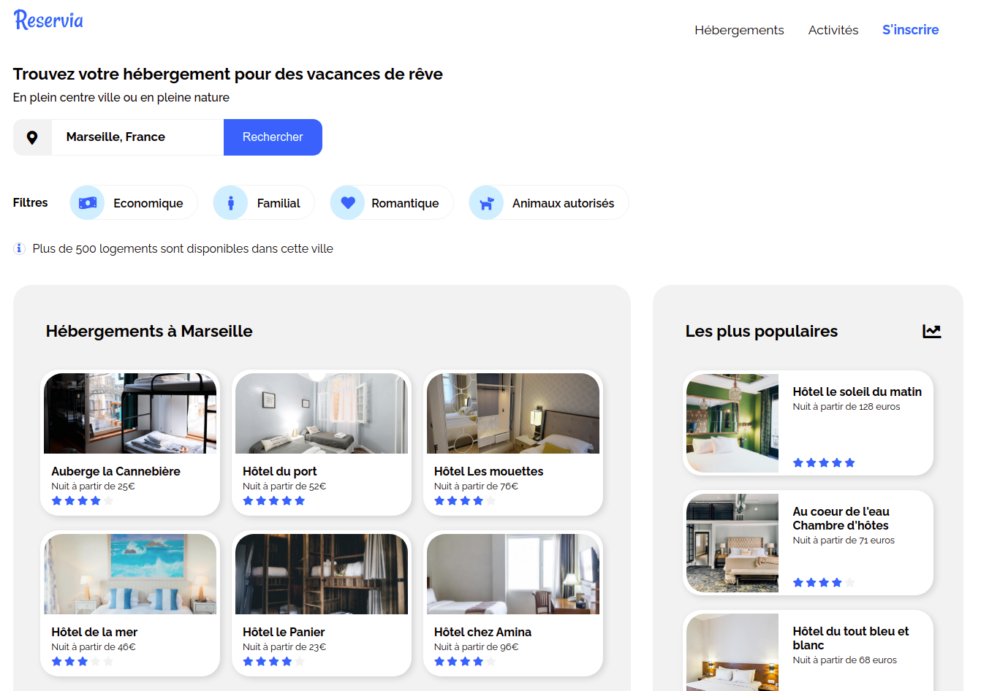

# Reservia

## Table of Contents

- [Context](#context)
- [Demonstration](#demonstration)
- [What this project allowed me to practice](#what-this-project-allowed-me-to-practice)
  - [Skills](#skills),
  - [Technologies / Methods](#technologies--methods)
- [Resources](#resources)
- [Expected deliverables](#expected-deliverables)

## Context 

**Reservia** would be a site that should allow users to book accommodation and activities in the city of their choice.

## Demonstration

**Reservia** is visible on https://codamor.github.io/Reservia/

## What this project allowed me to practice

### Skills

* cut and integrate a model,
* structure a web page with HTML5,
* style a web page with CSS3.

### Technologies / methods

* HTML5/CSS3
* positioning with Grid and FlexBox,
* responsive design with media queries.

## Resources

* desktop model,
* mobile model.

## Expected deliverables

* the search button should not be functional,

* each accommodation or activity card had to be clickable in its entirety (empty links),

* filters should not be functional for this version,
  * change of appearance on hover,
  * free choice of effect.

* The **Hébergements** and **Activités** links had to be anchors that lead to the sections of the page,

## Technical constraints

The site had to be adapted to :
  * desktop,
  * mobiles,
  * shelves (free adaptation).

Images adapted to the resolution and loading time,

Icons from the **Font Awesome** library,

Graphic charter:
  * blue #0065FC,
  * blue light version #DEEBFF,
  * gray for background #F2F2F2,
  * font : **RALEWAY**
  

